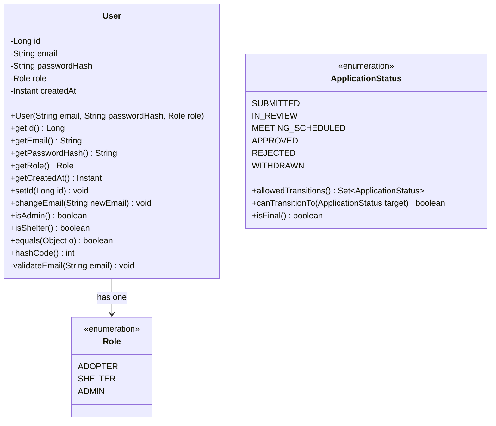
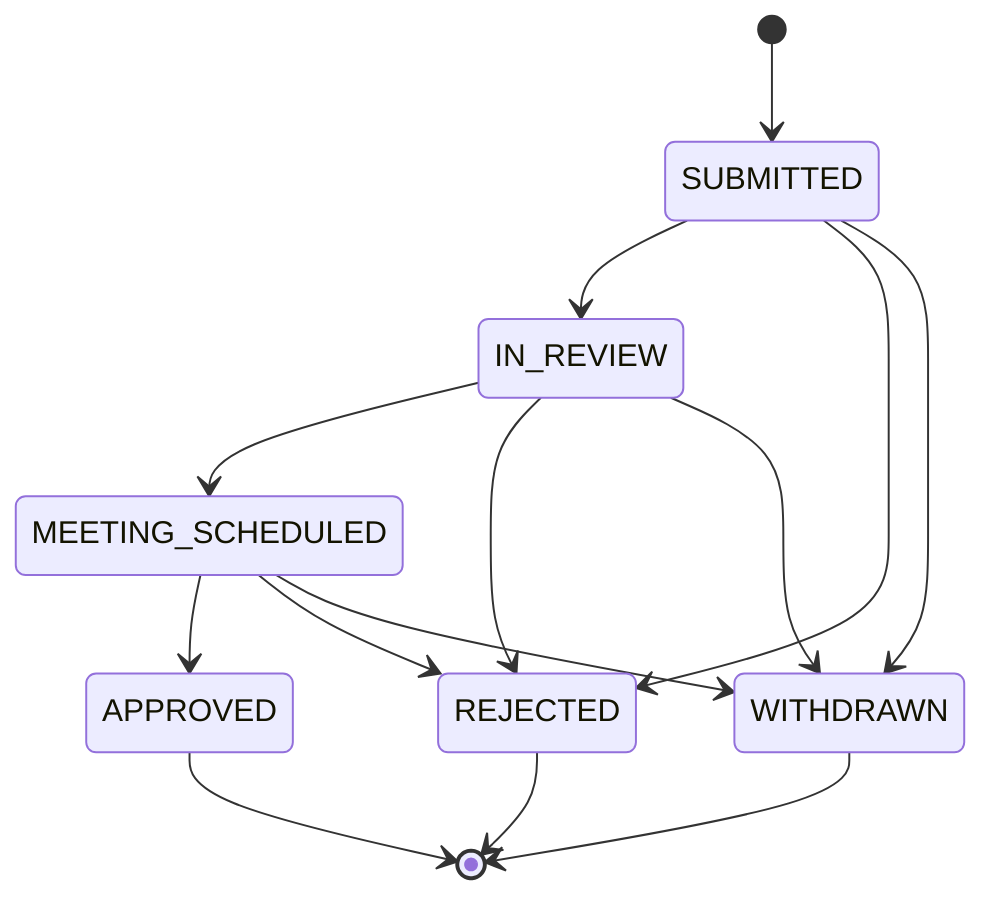
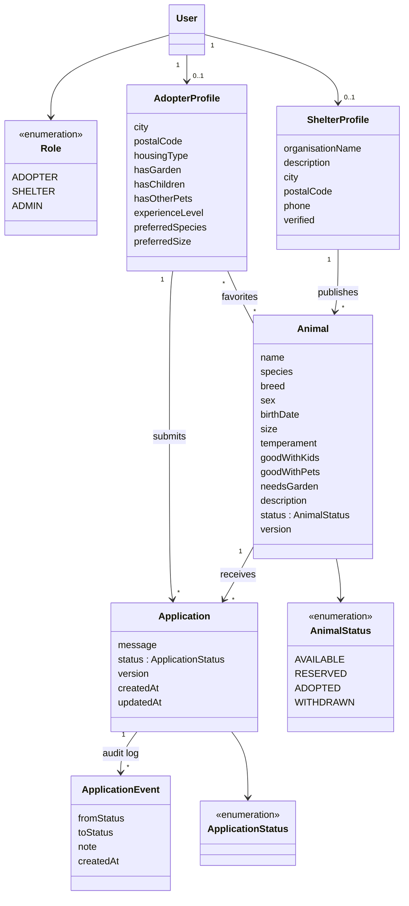
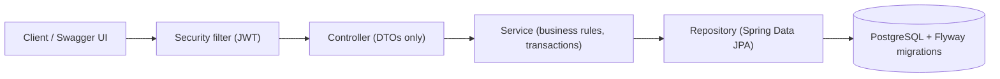

# Adopt-a-Pet: UML and method glossary

Living document. GitHub renders the Mermaid diagrams directly on the repository page.

**Status: end of Session 3.** Implemented: `Role`, `User`, `ApplicationStatus`. Everything under "Planned" does not exist yet.

**How to keep it up to date:** whenever a pull request adds or changes a class, update this file in the same pull request. Move classes from "Planned" to "Implemented" when they are done.

**Notation:** `+` public, `-` private, `$` static, `<<enumeration>>` an enum, `Set~X~` means `Set<X>`.

---

## 1. Implemented: class diagram

---

## 2. Implemented: the application workflow (state diagram)

`APPROVED`, `REJECTED`, and `WITHDRAWN` are final: no further transitions.

---

## 3. Method glossary: what does each method do?

### `User`

| Member | What it does | Rule / exception | Tests |
|---|---|---|---|
| `User(email, passwordHash, role)` | Creates a user. `id` stays `null`, `createdAt` is set to now | `IllegalArgumentException` if email is null/blank/has no `@`, if hash is null/blank, or if role is null | `constructor_*` |
| `getId()` | Returns the id, or `null` if the user isn't saved yet | none | `constructor_validInput_leavesIdNull` |
| `getEmail()`, `getPasswordHash()`, `getRole()`, `getCreatedAt()` | Plain getters | none | `constructor_validInput_*` |
| `setId(id)` | Assigns the database id, once | `IllegalStateException` if an id is already set, `IllegalArgumentException` if `id` is null | `setId_*` |
| `changeEmail(newEmail)` | Replaces the email | same validation as the constructor. On failure, the old email stays | `changeEmail_*` |
| `isAdmin()` | True if the role is `ADMIN` | none | `isAdmin_*` |
| `isShelter()` | True if the role is `SHELTER` | none | `isShelter_*` |
| `equals(o)` | Same user? Same object, or same non-null id and same class | an unsaved user is only equal to itself | `equals_*` |
| `hashCode()` | A fixed number for all users (picks the "locker" in a `HashSet`) | must not use the id, because the id changes when the user is saved | `hashCode_*`, `hashSet_*` |
| `validateEmail(email)` (private, static) | Shared email rule for the constructor and `changeEmail` | minimal on purpose: null, blank, no `@`. Format validation belongs in the API layer | tested through the constructor and `changeEmail` |

### `ApplicationStatus`

| Member | What it does | Rule / exception | Tests |
|---|---|---|---|
| `allowedTransitions()` | Returns the statuses reachable from this one (see the state diagram) | the returned set is unmodifiable. Final statuses return an empty set | `allowedTransitions_returnedSet_isUnmodifiable` |
| `canTransitionTo(target)` | True if `target` is in `allowedTransitions()` | `IllegalArgumentException` if `target` is null | `canTransitionTo_*` |
| `isFinal()` | True if `allowedTransitions()` is empty | derived, not a second copy of the table | `isFinal_*` |

---

## 4. Planned: domain model (not implemented yet)

---

## 5. Planned: layers and request flow

Rules: controllers stay thin, business logic lives in services, authorization is enforced server-side, schema changes only through Flyway.
